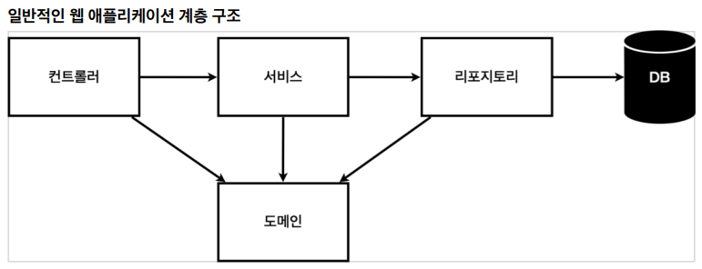
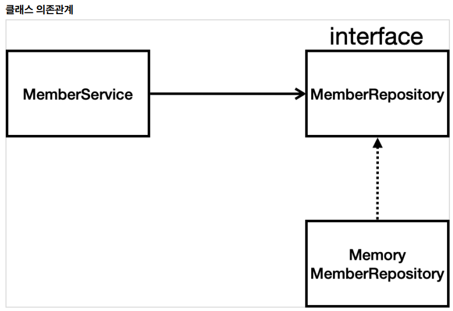

# hello-spring
spring 입문 강의(인프런-김영한 강의)

* * *

## spring-boot-devtools
> Spring boot  에서 제공하는 개발 편의를 위한 모듈.

#### 제공 기능
- Property Defaults
  - Tymeleaf 는 기본적으로 성능을 향상시키기 위해서 캐싱 기능을 사용한다. 하지만 개발하는 과정에서 캐싱 기능을 사용한다면 수정한 소스가 제대로 반영되지 않을 수 있기 때문에 cache의 기본값을 false로 설정할 수 있다.
- Automatic Restart
  - classpath 에 있는 파일이 변경될 때마다 애플리케이션을 자동으로 재시작해준다. 개발자가 소스 수정 후 애플리케이션을 재실행하는 과정을 줄일 수 있으므로 생산성을 향상시킬 수 있다.
- Live Reload
  - 정적 자원(html, css, js) 수정 시 새로고침 없이 바로 적용할 수 있다.
- Global Settings
- Remote Applications
   
* * *

## MVC와 템플릿 엔진
- Model, View, Contoller    
웹 브라우저 -> 내장 톰캣 서버 -> 스프링컨테이너에서 리턴과 함께 model 반환 -> viewResolver(Thymleaf 템플릿 엔진 처리)에서 HTML 변환 후 웹 브라우저에서 보여준다.

* * *

## @ResponseBody 사용 원리
> return시에 객체를 반환하려고 하는 경우에는 스프링에서 JsonConverter가 동작을 하고, String형식은 StringConverter가 동작한다. 
> 그래서 객체의 경우 JSON 형식으로 보이는 것을 알 수 있다.
> 요즘엔 대부분 Json으로 반환하여 사용한다.
1. HTTP의 BODY에 문자 내용을 직접 반환
2. 'viewResolver' 대신에 'HttpMessageConverter'가 동작 (Spring setting)
3. 기본 문자처리: StringHttpMessageConverter
4. 기본 객체처리: MappingJackson2HttpMessageConverter
5. byte 처리 등등 기타 여러 HttpMessageConverter가 기본으로 등록되어 있음

> 참고. 클라이언트의 HTTP Accept 해더와 서버의 컨트롤러 반환 타입 정보 둘을 조합해서 'HttpMessageConverter' 가 선택된다.

* * *

## 비즈니스 요구사항 정리
- 데이터: 회원ID, 이름
- 기능: 회원 등록, 조회
- 아직 데이터 저장소가 선정되지 않음(가상의 시나리오)

- 컨트롤러: 웹 MVC의 컨트롤러 역할
- 서비스: 핵심 비즈니스 로직 구현
- 리포지토리: 데이터베이스에 접근, 도메인 객체를 DB에 저장하고 관리
- 도메인: 비즈니스 도메인 객체, 예) 회원, 주문, 쿠폰 등등 주로 데이터베이스에 저장하고 관리됨   

- 아직 데이터 저장소가 선정되지 않아서, 우선 인터페이스로 구현 클래스를 변경할 수 있도록 설계
- 데이터 저장소는 RDB, NoSQL 등 다양한 저장소를 고민중인 상황으로 가정
- 개발을 진행하기 위해서 초기 개발 단계에서는 구현체로 가벼운 메모리 기반의 데이터 저장소 사용